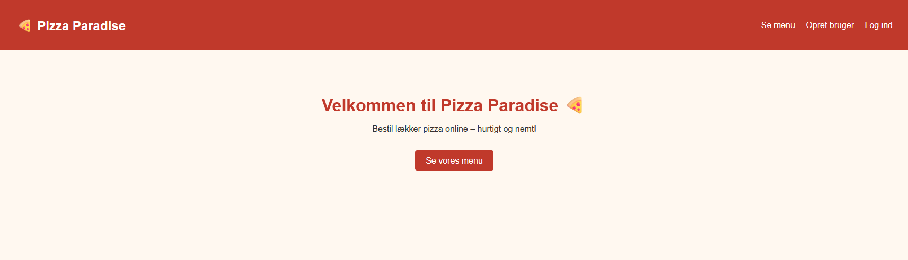
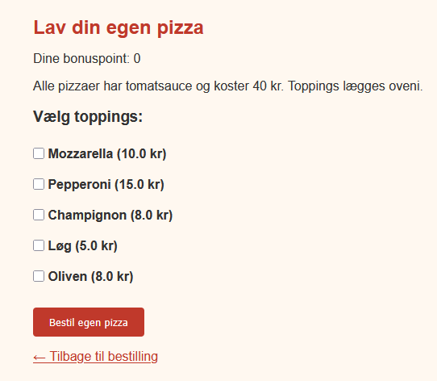
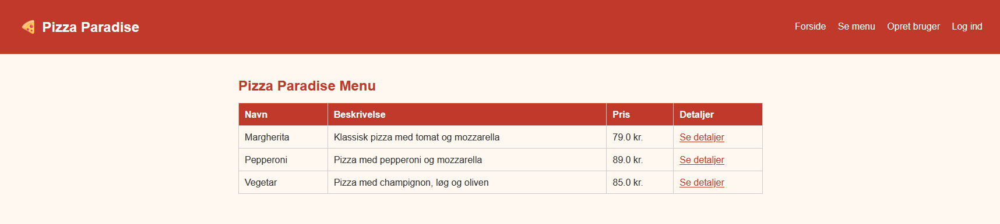
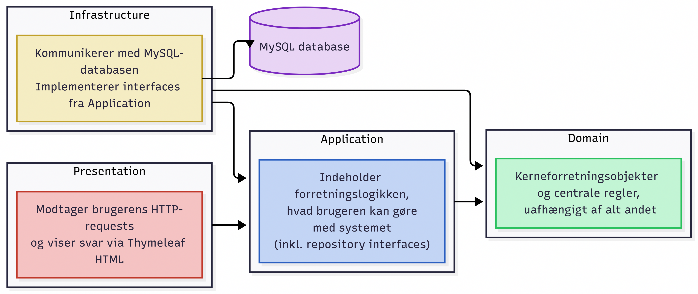
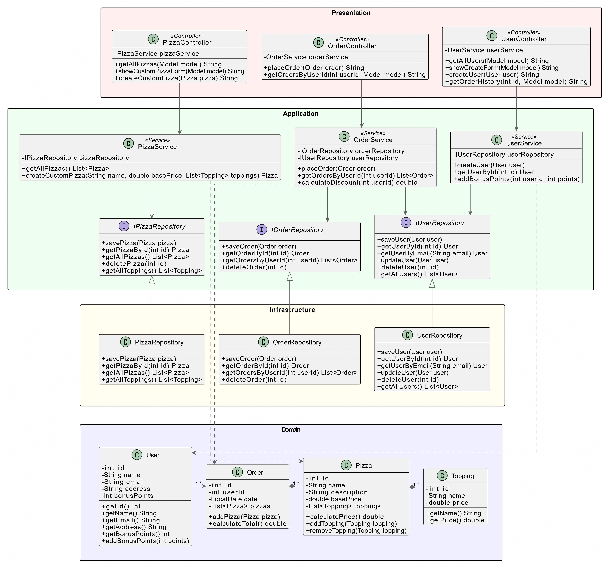

# Pizza Paradise – Pizzabestillingssystem
,,

---

## Beskrivelse

Et Spring Boot pizzabestillingssystem hvor brugere kan oprette en konto, bestille pizzaer, lave deres egen custom pizza med valgfrie toppings og optjene bonuspoint der giver rabat på næste ordre.

Applikationen er bygget med Clean Architecture, hvor afhængigheder kun peger indad mod domænelaget.

Zealand Erhvervsakademi Næstved.
DAT-2025, 2. Semester.

---
## Funktionalitet

* Brugeroprettelse og login via email
* Pizzamenu med standardpizzaer
* Custom pizza med valgfrie toppings
* Bestillingshistorik per bruger
* Bonuspoint: 1 point per 10 kr brugt, 1 point = 1 kr rabat
* Global fejlhåndtering med @ControllerAdvice

---

## Arkitektur

### Lagdiagram

Systemet er bygget med Clean Architecture opdelt i fire lag:

---

## Klasse diagram

**Domain** indeholder systemets kerneforretningsobjekter.
`User` repræsenterer en bruger med navn, email og bonuspoint.
`Pizza` repræsenterer en pizza med navn, pris og toppings, og kan beregne sin egen pris.
`Topping` er en ingrediens med navn og pris.
`Order` samler en brugers bestilling og kan beregne totalpris inkl. rabat.

**Application** indeholder forretningslogikken via tre services.
`UserService` håndterer oprettelse, login og bonuspoint.
`PizzaService` håndterer menuen og custom pizzaer.
`OrderService` håndterer bestillinger, prisberegning og rabat.
Services kommunikerer kun med interfaces (`IPizzaRepository`, `IOrderRepository`, `IUserRepository`) og kender ikke til databasen.

**Infrastructure** implementerer repository-interfaces defineret i Application-laget.
`UserRepository`, `PizzaRepository` og `OrderRepository` gemmer og henter data fra MySQL-databasen via JDBC.

**Presentation** indeholder controllers der modtager HTTP-requests fra brugeren og kalder de relevante services.
`UserController` håndterer login og oprettelse.
`PizzaController` håndterer menuen og custom pizza.
`OrderController` håndterer bestilling og ordrehistorik.
Controllers indeholder ingen forretningslogik, men fungerer som bindeled mellem bruger og system.

---

## Refleksion

### Hvorfor giver opdeling af ansvar god mening?

Systemet har mange forskellige ansvarsområder, som brugere, pizzaer, ordrer og betaling.

Med Clean Architecture ved hver klasse præcis hvad den skal gøre og ingenting andet.
Dette reducerer koblingen mellem lagene og gør systemet mere fleksibelt, lettere at teste og nemmere at arbejde på i en gruppe.

---

### Hvad hvis databaseteknologien skal ændres?

Infrastructure-laget er det eneste sted der ved noget om MySQL og JDBC.

Hvis vi skiftede til fx PostgreSQL, skulle vi kun ændre i repositories.
Domain ændres ikke fordi det kun beskriver data og regler.
Application ændres heller ikke fordi det kalder på repository-metoder gennem interfaces uden at bekymre sig om databasen.
Presentation ville slet ikke mærke ændringer, da den kun bruger service-metoderne og ikke behøver at vide noget om databasen.

---

## Kør projektet

1. Opret en MySQL database kaldet `pizzaparadise`
2. Kopier `application.properties.example` til `application.properties` og udfyld dine databaseoplysninger
3. Sæt `spring.sql.init.mode=always` første gang for at oprette tabeller og indsætte testdata
4. Åbn projektet i IntelliJ
5. Kør `HwPizzaParadiseApplication`
6. Gå til http://localhost:8080

---

## Tests

Kør unit tests i IntelliJ med grøn play-knap på testklasserne.

Tests dækker UserService, PizzaService og OrderService med Mockito, samt domain-tests for User, Pizza og Order.
